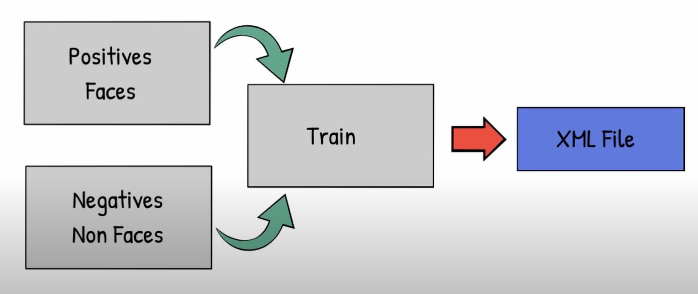

##  [車牌偵測辨識系統]
---

### Introduction for Trained Weights and Models 

 

### Dependencies and Installation
* python=3.6.
* opencv-python=3.3.0.9

### Original License Plate Image

 

### Predicted results on test set

#### Predicted Results :

 

#### Captured License Plate Image :

 
